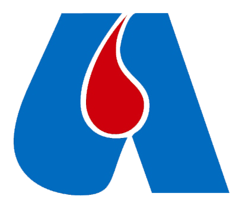

Besides statistical life, I am an active volunteer for the following associations:

### Italian Red Cross (CRI)

<!--
The International Federation of Red Cross and Red Crescent Societies ([IFRC](https://www.ifrc.org)) is the world's largest humanitarian network.
The Italian Red Cross ([CRI](https://cri.it)) is the national society of Italy. It is engaged in various activities to support the population in health, social, migration, and emergency situations.
-->

The Italian Red Cross ([CRI](https://cri.it) - Croce Rossa Italiana) is a humanitarian organisation that provides assistance and protection in times of war, natural disasters, and other emergencies. It operates under the principles of the International Red Cross and Red Crescent Movement ([IFRC](https://www.ifrc.org)), the world's largest humanitarian network.
Its main activities include health and social care, emergency response, disaster relief, first aid training, and support for vulnerable populations, both in Italy and abroad.

### Blood donation (AVIS) 

The Association of Voluntary Italian Blood Donors ([AVIS](https://www.avis.it)) is a non-profit Italian organisation that promotes and organises voluntary, anonymous, and unpaid blood donations. Its main objectives are to ensure a sufficient supply of safe blood and blood components for the national healthcare system, raise public awareness about the importance of regular blood donation, and support scientific research and education in transfusion medicine.

<!-- 
 -->

The Association of Voluntary Italian Blood Donors ([AVIS](https://www.avis.it)) is a non-profit Italian organisation that promotes and organises voluntary, anonymous, and unpaid blood donations. Its main objectives are to ensure a sufficient supply of safe blood and blood components for the national healthcare system, raise public awareness about the importance of regular blood donation, and support scientific research and education in transfusion medicine. 

