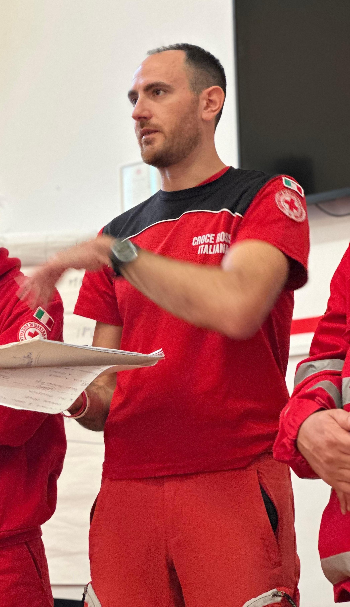
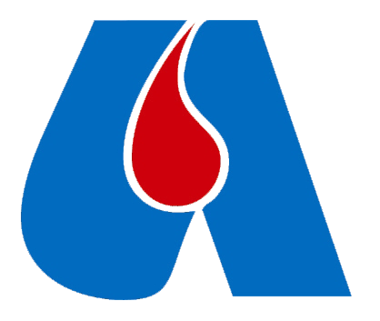
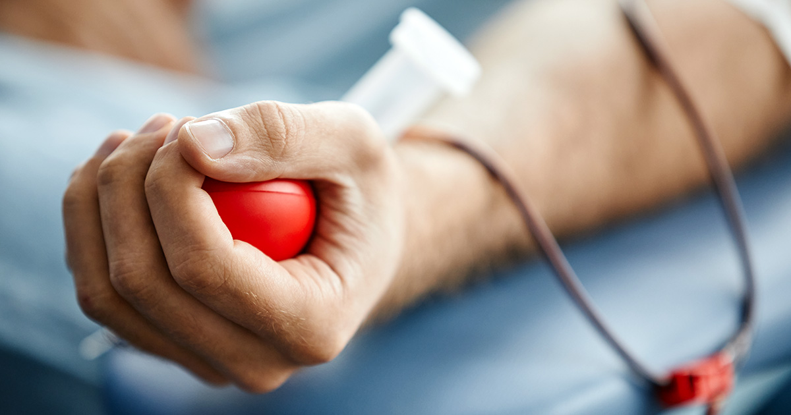

<!-- NonStat Life
> "_The heart of a volunteer is never measured in size, but by the depth of the commitment to make a difference in the lives of others_"
-->

&nbsp;

	

	"<i>The heart of a volunteer is never measured in size, but by the depth of the commitment to make a difference in the lives of others</i>"
	  DeAnn Hollis
	

&nbsp;

Besides statistical life, I am an active volunteer for the following associations:

### &#10010; &#128657; - Italian Red Cross (CRI)

I volunteer as a Rescuer and Ambulance driver at the Italian Red Cross. 

The Italian Red Cross (<a href="https://cri.it">CRI</a> - Croce Rossa Italiana) is a humanitarian organisation that provides assistance and protection in times of war, natural disasters, and other emergencies. It operates under the principles of the International Red Cross and Red Crescent Movement (<a href="https://www.ifrc.org">IFRC</a>), the world's largest humanitarian network.
Its main activities include health and social care, emergency response, disaster relief, first aid training, and support for vulnerable populations, both in Italy and abroad.

* "[_A Memory from Solferino_](https://volunteeringredcross.org/en/recurso/a-memory-of-solferino-henry-dunant/)", a book by Henry Dunant (founder of the Red Cross and first Nobel Peace Prize)

&nbsp;

	

	<h3>&#128213; <b>New book Coming soon!!</b></h3>
	I'm writing a book about the situations and feelings of a volunteer in the ambulance service, based on my personal experience. It will be out (hopefully) by the end of summer 2026...stay tuned!
	

&nbsp;

&nbsp;

### &#129656; - Blood donation (AVIS) 
<!--  -->

I am a blood donor associated with AVIS.

The Association of Voluntary Italian Blood Donors (<a href="https://www.avis.it">AVIS</a>) is a non-profit Italian organisation that promotes and organises voluntary, anonymous, and unpaid blood donations. Its main objectives are to ensure a sufficient supply of safe blood and blood components for the national healthcare system, raise public awareness about the importance of regular blood donation, and support scientific research and education in transfusion medicine.

<!--

The Association of Voluntary Italian Blood Donors (<a href="https://www.avis.it">AVIS</a>) is a non-profit Italian organisation that promotes and organises voluntary, anonymous, and unpaid blood donations. Its main objectives are to ensure a sufficient supply of safe blood and blood components for the national healthcare system, raise public awareness about the importance of regular blood donation, and support scientific research and education in transfusion medicine. 

-->